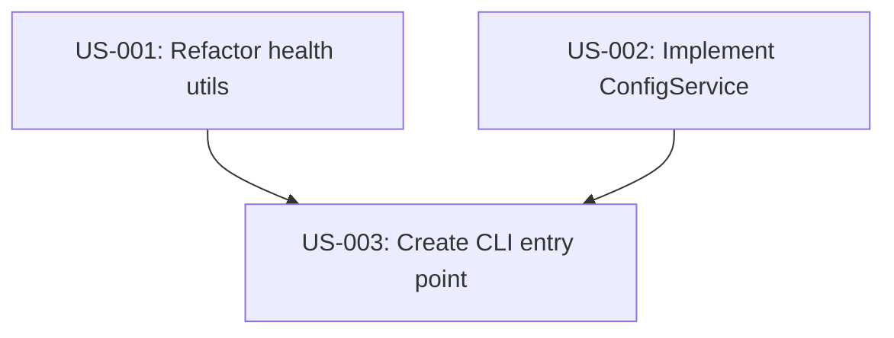

# PRD: CLI Version of Universal Agent Quota Tracker

## Initial ask

Create a CLI version of the app to monitor agent quotas from the terminal, decoupled from VS Code.

## Problem statement

Currently, users can only check their agent quotas within VS Code. This limits usage in:
- Headless environments (servers, CI/CD)
- Terminal-centric workflows
- Quick checks without opening the IDE

## Functional requirements

### F1: Core quota fetching
The CLI must fetch quotas from all supported providers, reusing existing logic.

- **F1.1. Provider support** — Support Antigravity, Claude Code, Codex, Gemini CLI, Z.AI
- **F1.2. Unified interface** — Single command to fetch all configured providers
- **F1.3. Error handling** — Gracefully handle network errors or unconfigured providers without crashing

### F2: Output formats
Support human-readable and machine-readable outputs.

- **F2.1. Table output (default)** — Display quotas in a formatted ASCII table
- **F2.2. JSON output** — Support `--json` flag for raw data output (useful for scripts)

### F3: Configuration & Auth
Manage configuration independent of VS Code's `SecretStorage`.

- **F3.1. Environment variables** — Prioritize env vars for API keys (e.g., `ZAI_API_KEY`)
- **F3.2. Config file** — Fallback to local config file (e.g., `~/.config/universal-agent-quota/config.json`)
- **F3.3. Config command** — (Optional for V1) Manual editing of config file is sufficient

### F4: CLI Interface
Standard CLI behavior.

- **F4.1. Help command** — `--help` flag showing usage
- **F4.2. Version command** — `--version` flag showing package version

## Non-functional requirements

- **NF1. Performance** — minimal startup overhead
- **NF2. Code reuse** — Share core logic with VS Code extension (no code duplication)
- **NF3. Safety** — Read-only access to quotas (except for local config)

## Technical constraints

- **TC1. Node.js** — Must run on Node.js environment
- **TC2. VS Code dependencies** — Core logic must be stripped of `vscode` module imports

## Quality gates

These commands must pass for every user story:
- `npm run lint`
- `npm run compile`

## User stories

### US-001: Refactor health utils
**Description:** As a developer, I want to separate health calculation logic from VS Code UI so that I can reuse it in the CLI.

**Implements:** F1.1, NF2

**Acceptance Criteria:**
- [ ] Split `src/utils/health.ts` into `health-core.ts` (logic) and `health-vscode.ts` (UI)
- [ ] Update `src/providers/*` to import from `health-core.ts`
- [ ] Verify VS Code extension still compiles and works

### US-002: Implement ConfigService
**Description:** As a developer, I want a platform-agnostic configuration service so that I can manage secrets in both CLI and VS Code.

**Implements:** F3.1, F3.2

**Acceptance Criteria:**
- [ ] Create `src/services/configService.ts` interface
- [ ] Implement `VSCodeConfigService` (wraps `ExtensionContext.secrets`)
- [ ] Implement `CLIConfigService` (reads Env vars + JSON file)
- [ ] Refactor `ApiKeyService` to use `ConfigService`

### US-003: Core CLI Architecture
**Description:** As a developer, I want to establish the basic CLI structure with argument parsing and a simple "hello world" output to verify the build pipeline.

**Implements:** F4.1, F4.2

**Acceptance Criteria:**
- [ ] Create `src/cli.ts` entry point
- [ ] Implement basic argument parsing (`--help`, `--version`, `--json`)
- [ ] Configure `package.json` with `bin` entry
- [ ] Ensure `npm run compile` builds the CLI correctly
- [ ] Verify `node ./out/cli.js --version` prints version

### US-004: Wire up Providers to CLI
**Description:** As a user, I want the CLI to actually fetch data from the providers using the new ConfigService.

**Implements:** F1.1, F1.2

**Acceptance Criteria:**
- [ ] Instantiate `ProviderRegistry` in `src/cli.ts`
- [ ] Inject `CLIConfigService` into registry
- [ ] Fetch quotas from all providers
- [ ] Log raw results to console (temporary output)

### US-005: Implement Table Output
**Description:** As a user, I want to see my quotas in a readable table format.

**Implements:** F2.1

**Acceptance Criteria:**
- [ ] Install `cli-table3`
- [ ] Create `TableFormatter` class
- [ ] Render provider results into table
- [ ] Handle error states in table rows

### US-006: Implement JSON Output
**Description:** As a script writer, I want JSON output for automation.

**Implements:** F2.2

**Acceptance Criteria:**
- [ ] Implement `--json` flag logic
- [ ] Output pure JSON to stdout (no extra logs)

## Story dependencies

## Design considerations

- **DC1. Dependency Injection** — Inject `ConfigService` into providers/services to switch between CLI/VS Code modes.
- **DC2. ASCII Tables** — Use a lightweight library like `cli-table3` or simple string formatting for table output.

## Open questions

1. **Config file location:** Where exactly should the config file live on different OSs?
   - a. `~/.config/universal-agent-quota/config.json` (Linux/Mac standard) _(recommended)_
   - b. User home root `.universal-agent-quota`

2. **Table Library:** Use a library or custom formatting?
   - a. `cli-table3` (prettier, handles wrapping) _(recommended)_
   - b. Custom formatting (zero dependency, but harder to maintain)
