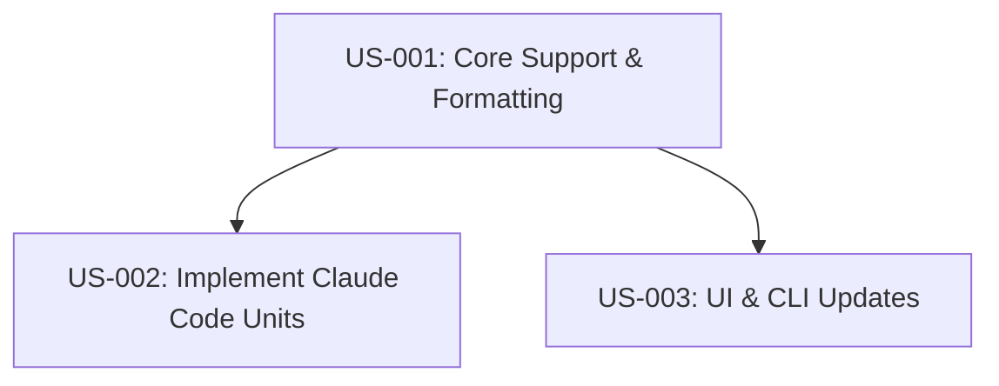

# PRD: Quota Units Reporting

## Initial ask
"This reports percentages can it report units as well? (eg requests)"

## Problem statement
Currently, the system only reports `remainingPercent`. Users often want to know the absolute units (e.g., "$2.50 used", "50 requests remaining") to better understand their usage, especially when the percentage is abstract or when they are tracking specific budgets.

## Functional requirements

### F1: Core Data Model Update
Extend the data model to support optional unit information.

- **F1.1. Unit fields** — Add `remainingUnits`, `totalUnits`, `usedUnits`, and `unitName` to `ModelQuota`.
- **F1.2. Compatibility** — Fields are optional to support providers that only return percentages.
- **F1.3. Formatting Helper** — Central utility to consistently format quota strings (percentage + units).

### F2: Provider Implementation
Populate unit data where available.

- **F2.1. Claude Code** — Populate with USD values (e.g., `totalUnits: 5.0`, `unitName: 'USD'`).
- **F2.2. Gemini/Antigravity** — Add interface support (implementation pending upstream API support).

### F3: UI/CLI Updates
Display units in user interfaces.

- **F3.1. VS Code Tree View** — Show units in tree item description and tooltip (e.g., "Remaining: 40% ($2.00 / $5.00)").
- **F3.2. CLI Table** — Add units to the "Remaining" column.

## Non-functional requirements
- **NF1. Backward Compatibility** — Existing views must work without unit data.
- **NF2. Readability** — Unit formatting should be concise (e.g., "$2.50", not "2.5000 USD").

## Technical constraints
- **TC1. Data Availability** — Only Claude Code currently has clear unit data (USD) calculated client-side. Gemini API integration returns fractions only.

## Quality gates
These commands must pass for every user story:
- `npm run compile`
- `npm run lint`

## User stories

### US-001: Core Support & Formatting
**Description:** As a developer, I want core type support and a formatting utility so that I can consistently display units across the app.

**Implements:** F1.1, F1.2, F1.3

**Acceptance Criteria:**
- [ ] Update `src/types.ts` with optional `remainingUnits`, `totalUnits`, `unitName`.
- [ ] Create `src/utils/format.ts` with `formatQuota(model)` function.
- [ ] Test: `formatQuota` correctly formats USD (e.g., "$2.50 / $5.00").
- [ ] Test: `formatQuota` correctly formats generic units (e.g., "50 / 100 requests").
- [ ] Test: `formatQuota` handles missing units gracefully (returns "% only").

### US-002: Implement Claude Code Units
**Description:** As a user, I want to see my Claude Code usage in USD.

**Implements:** F2.1

**Acceptance Criteria:**
- [ ] Update `src/providers/claude-code.ts` to populate unit fields.
- [ ] Use `unitName: 'USD'`.
- [ ] `totalUnits` should be `5.0` (DEFAULT_5_HOUR_LIMIT_USD).
- [ ] `remainingUnits` calculated from `costUSD`.

### US-003: UI & CLI Updates
**Description:** As a user, I want to see units in the VS Code sidebar and CLI.

**Implements:** F3.1, F3.2

**Acceptance Criteria:**
- [ ] Update `src/views/quotaTreeProvider.ts` to use `formatQuota`.
- [ ] Update `src/cli/tableFormatter.ts` to use `formatQuota` or similar logic.
- [ ] Verify VS Code tree item description shows units.
- [ ] Verify VS Code tooltip shows detailed breakdown.
- [ ] Verify CLI table shows units in "Remaining" column.

## Story dependencies

## Design considerations
- **DC1. Unit Formatting** — For 'USD', prefix with `$`. For others, suffix with `unitName`.
- **DC2. Precision** — Round USD to 2 decimal places. Round requests/integers to 0 decimal places.
