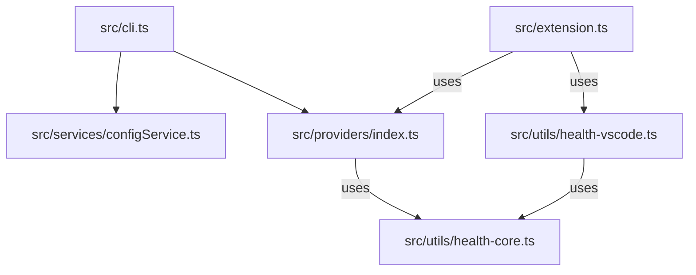

# TDD: CLI Version of Universal Agent Quota Tracker

## Initial ask

Create a CLI version of the app, decoupled from VS Code dependencies.

## Data models

```typescript
// src/services/configService.ts

export interface IConfigService {
  getSecret(key: string): Promise<string | undefined>;
  setSecret(key: string, value: string): Promise<void>;
  deleteSecret(key: string): Promise<void>;
}

// CLI config file format
interface CLIConfig {
  secrets: Record<string, string>;
  settings?: Record<string, any>;
}
```

## Pseudocode breakdown

## User Stories Implementation Plan

### US-001: Refactor health utils
- **Goal:** Isolate pure logic.
- **Files:** `health-core.ts`, `health-vscode.ts`.
- **Tests:** Verify `calculateHealth` (logic) independent of VS Code.

### US-002: Implement ConfigService
- **Goal:** Abstract secret access.
- **Files:** `src/services/configService.ts`.
- **Tests:** Mock env vars and file reads to verify `CLIConfigService` priority logic.

### US-003: Core CLI Architecture
- **Goal:** Basic "Hello World" CLI.
- **Files:** `src/cli.ts`.
- **Tests:** Manual run `node out/cli.js --version`.

### US-004: Wire up Providers to CLI
- **Goal:** Fetch real data in CLI.
- **Files:** Update `src/cli.ts`, `src/providers/index.ts`.
- **Tests:** Run and check console logs for quota objects.

### US-005: Implement Table Output
- **Goal:** Pretty print.
- **Files:** `src/cli/tableFormatter.ts`.
- **Tests:** Unit test formatter with mock data.

### US-006: Implement JSON Output
- **Goal:** Machine output.
- **Files:** `src/cli.ts`.
- **Tests:** Verify `node out/cli.js --json | jq .` works.

## Call graph



## Files

**New files:**
- `src/cli.ts`
- `src/services/configService.ts`
- `src/utils/health-core.ts`
- `src/utils/health-vscode.ts`

**Modified files:**
- `src/utils/health.ts` (Deleted/Split)
- `src/providers/*.ts` (Update imports)
- `src/extension.ts` (Update imports)
- `package.json` (Add bin, dependencies)

## Testing strategy

### Running tests
- `npm run test` (Existing tests should pass)
- Manual verification of CLI: `ts-node src/cli.ts`

### New tests
- `src/services/configService.test.ts`: Test priority (Env > File) and file I/O.
- `src/utils/health-core.test.ts`: Unit tests for health logic (moved from existing tests if any).

## Open questions

1. **Provider Registry Injection:** `ProviderRegistry` currently creates providers inside its constructor. Should we change it to accept an `ApiKeyService` or `ConfigService`?
   - a. Yes, refactor `ProviderRegistry` to accept `ApiKeyService` in constructor. _(recommended)_
   - b. Use a global singleton for Config.

2. **Table Output:**
   - a. `cli-table3`
   - b. `console.table` (built-in, but limited formatting)
